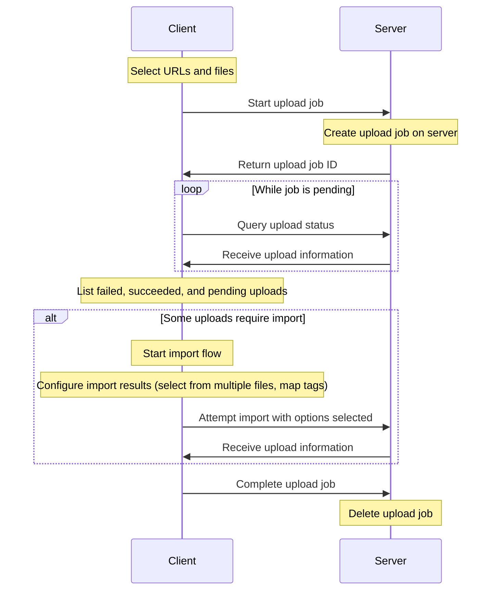

Refactor the upload process to integrate importing files and using extractors (for ex. yt-dlp).

Process should roughly resemble the following diagram:

```mermaid
sequenceDiagram 
    Note over Client: Select URLs and files
    Client->>Server: Start upload job
    Note over Server: Create upload job on server
    Server->>Client: Return upload job ID
    loop While job is pending
        Client->>Server: Query upload status
        Server->>Client: Receive upload information
    end
    Note over Client: List failed, succeeded, and pending uploads
    alt Some uploads require import
        Note over Client: Start import flow
        Note over Client: Configure import results (select from multiple files, map tags)
        Client->>Server: Attempt import with options selected
        Server->>Client: Receive upload information
    end
    Client->>Server: Complete upload job
    Note over Server: Delete upload job
```